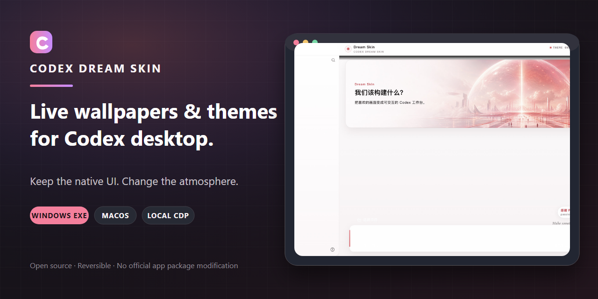

<h1 align="center">Codex Dream Skin</h1>

<p align="center">
  <strong>Themes, image wallpapers, and live wallpapers for the Codex desktop app.</strong><br>
  Keep the native sidebar, tasks, project picker, and composer. Never patch the official app package.
</p>

<p align="center">
  <a href="./README.md">中文</a> · <strong>English</strong>
</p>

<p align="center">
  <a href="https://github.com/CCDawn/Codex-Dream-Skin-Enhanced/releases/latest"></a>
  <a href="https://github.com/CCDawn/Codex-Dream-Skin-Enhanced/releases"></a>
  <a href="https://github.com/CCDawn/Codex-Dream-Skin-Enhanced/actions/workflows/ci.yml"></a>
  <a href="./LICENSE"></a>
</p>

<p align="center">
  
</p>

<p align="center">
  <a href="https://github.com/CCDawn/Codex-Dream-Skin-Enhanced/releases/latest/download/CodexDreamSkinManager.exe"><strong>Download Windows EXE</strong></a>
  ·
  <a href="#macos-installation">Install on macOS</a>
  ·
  <a href="./docs/showcase.en.md">View showcase</a>
  ·
  <a href="https://github.com/CCDawn/Codex-Dream-Skin-Enhanced/issues">Report an issue</a>
</p>

> Unofficial and not affiliated with OpenAI. Codex Dream Skin injects themes through loopback-only `127.0.0.1` CDP. It does not modify WindowsApps, `.app`, `app.asar`, or the official code signature.

## Why use it

- **The native UI stays interactive** — This is not a fake screenshot over the window. Sidebar, chat, tasks, and composer continue to work.
- **Live wallpapers inside Codex** — Windows supports muted, looping local MP4/WebM backgrounds. It does not change your desktop wallpaper.
- **One Windows manager** — Browse, search, preview, and switch wallpapers; control reveal; pause the skin; or restore the stock appearance.
- **Turn images into themes** — Import PNG, JPEG, or WebP artwork and keep full-window composition readable.
- **Reversible and auditable** — No official binary patching. Stop injection and return to the stock Codex appearance at any time.
- **Windows and macOS** — Windows ships a self-contained EXE; macOS ships a menu-bar Studio and installation scripts.

## Windows: start in 30 seconds

1. Download [`CodexDreamSkinManager.exe`](https://github.com/CCDawn/Codex-Dream-Skin-Enhanced/releases/latest/download/CodexDreamSkinManager.exe).
2. Run it and select a PNG, JPEG, WebP, MP4, or WebM from your wallpaper library.
3. Click **应用到 Codex**. Use **启动 / 重新应用** if Codex needs the skin reapplied.

The manager is a self-contained single-file app with the tested Dream Skin engine and Node.js runtime embedded. End users do not need the .NET SDK, Node.js, or manual PowerShell commands.

> Releases are currently unsigned, so Windows may show an unknown-publisher prompt. Download only from this repository's [Releases](https://github.com/CCDawn/Codex-Dream-Skin-Enhanced/releases) page and verify the companion `.sha256` file.

### Wallpaper reveal

The right-side slider controls the relationship between the theme veil and the wallpaper:

- `100%` shows the original image/video with the page-wide veil reduced to zero.
- Lower values increase text-area and theme treatment visibility for busy backgrounds or task pages.

## macOS installation

Open [`macos/`](./macos/) and double-click:

```text
Install Codex Dream Skin.command
```

Or run:

```bash
cd macos
./scripts/install-dream-skin-macos.sh
```

Use the menu-bar Studio to import, save, and switch image themes. See [`macos/README.md`](./macos/README.md) for the full guide.

## Feature matrix

| Feature | Windows | macOS |
|---|:---:|:---:|
| PNG / JPEG / WebP image themes | ✅ | ✅ |
| MP4 / WebM live wallpapers | ✅ | — |
| Graphical theme manager | ✅ Standalone EXE | ✅ Menu-bar Studio |
| Wallpaper search and preview | ✅ | ✅ |
| Save and switch themes | ✅ | ✅ |
| Wallpaper reveal control | ✅ | — |
| Pause injection / restore stock appearance | ✅ | ✅ |
| Modifies official app files | **Never** | **Never** |

## Real results

| Windows / shared theme | macOS dark theme |
|---|---|
|  |  |

See [`docs/showcase.en.md`](./docs/showcase.en.md) for more real screenshots, the character preset, and eight concept directions.

## How it works

```text
Local wallpaper / theme config
              ↓
Dream Skin local theme store
              ↓
127.0.0.1 loopback CDP
              ↓
Independent background layer in the Codex renderer
              ↓
Native sidebar, tasks, and composer stay interactive
```

Windows videos are transferred to the renderer in chunks and assembled into a Blob URL. Players and blobs are released when switching, pausing, or cleaning up. Video pauses automatically while the page is hidden.

## Security boundaries

- CDP binds only to `127.0.0.1`; it is not exposed to your LAN.
- The project does not modify WindowsApps, `.app`, `app.asar`, or official signatures.
- It does not read or rewrite API keys, base URLs, model providers, or Codex conversation content.
- Avoid running untrusted local programs while a debugging port is active; a malicious local process may attempt to access it.
- Official Codex updates can change the DOM. If a theme stops applying, try **启动 / 重新应用** and check [Issues](https://github.com/CCDawn/Codex-Dream-Skin-Enhanced/issues).

## Run from source and build

### Windows script entry points

```powershell
powershell.exe -ExecutionPolicy Bypass -File .\windows\scripts\install-dream-skin.ps1
powershell.exe -ExecutionPolicy Bypass -File .\windows\scripts\start-dream-skin.ps1
```

### Build the single-file EXE

Requires the .NET 8 SDK and Node.js 22+:

```powershell
powershell.exe -NoProfile -ExecutionPolicy Bypass -File .\windows\app\build-manager.ps1
```

Output is written to `windows/dist/`. The build runs the Windows regression suite, publishes a self-contained `win-x64` EXE, and executes a post-publish self-test.

### Tests

```powershell
powershell.exe -NoProfile -ExecutionPolicy Bypass -File .\windows\tests\run-tests.ps1
```

```bash
bash macos/tests/run-tests.sh
```

## FAQ

<details>
<summary><strong>Is this a Wallpaper Engine replacement?</strong></summary>

No. It controls only the theme background inside Codex. The Windows manager can import ordinary MP4/WebM files, but it does not render Wallpaper Engine Scene, Web, or packaged projects.
</details>

<details>
<summary><strong>Why can an official Codex update break a theme?</strong></summary>

Dream Skin depends on the Codex renderer DOM and local CDP. Official updates can move those structures. **启动 / 重新应用** often fixes it; compatibility patches are published in this repository.
</details>

<details>
<summary><strong>Can I return to completely stock Codex?</strong></summary>

Yes. The Windows manager provides **恢复官方外观**, and the macOS Studio includes uninstall/restore actions. No official application package is patched.
</details>

<details>
<summary><strong>Are wallpaper files uploaded?</strong></summary>

No. Wallpapers and themes stay local, and injection uses only a loopback connection on your machine.
</details>

## Documentation

- [Windows guide](./windows/README.en.md)
- [macOS guide](./macos/README.md)
- [Platform and path map](./docs/platforms.md)
- [Showcase](./docs/showcase.en.md)
- [Reference image-generation prompts](./docs/reference-background-prompt-guide.en.md)
- [Concept prompt breakdown](./docs/background-generation-prompts.md)
- [Project notes](./docs/PROJECT.md)

## Sponsor

<p align="center">
  <a href="https://passion8.cc/register?aff=TuPe">
    
  </a>
</p>

Thanks to [passion8.cc](https://passion8.cc/register?aff=TuPe) for sponsoring this project. Theme installation and API configuration remain separate; this project never rewrites model-provider settings.

## Feedback and contributions

- Use the [Bug / Feature issue templates](./.github/ISSUE_TEMPLATE/).
- PRs should include the platform, reproduction or goal, validation command, and restore test.
- Contribution guide: [中文](./.github/CONTRIBUTING.md) · [English](./.github/CONTRIBUTING.en.md)

This repository is an enhanced derivative of [Fei-Away/Codex-Dream-Skin](https://github.com/Fei-Away/Codex-Dream-Skin) and preserves the full upstream history.

## License and trademark notice

[MIT License](./LICENSE). Not affiliated with OpenAI. Codex and related trademarks belong to their respective owners. Character/IP assets in presets and previews are examples only; confirm likeness, asset, and trademark rights before redistribution.

---

If Dream Skin makes Codex feel more like your own workspace, consider leaving a **Star** and sharing a screenshot of your theme.
